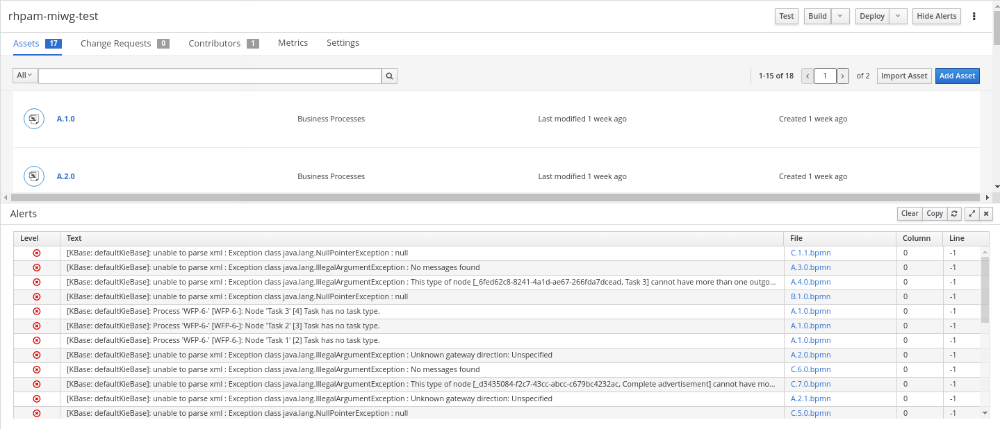

= RH-PAM BPMN MIWG Test

:numbered:

== Overview
The purpose of this `KIE project` is to test sample BPMN provided by the link:http://www.omgwiki.org/bpmn-miwg/doku.php[OMG BPMN MIWG] using RH-PAM tooling.

There are a total of 16 sample BPMN files (provided by the OMG BPMN MIWG) copied to this KIE project.

=== RH-PAM Version
The version of RH-PAM tooling utilized is:   RH-PAM 7.9  (7.44.0.Final-redhat-00003)

=== Result Summary

*kie-maven-plugin* :   Using the RH-PAM org.kie:kie-maven-plugin, there are a considerable number of compilation exceptions.

*Business Central*:
In Business Central, these 16 sample BPMN files do render.
However, when building these 16 sample BPMN files in Business Central, the following is displayed to the end-user:

=== Recommendations

. Prevent NPEs and instead log a message with sufficient context;  ie:
+
-----
[ERROR] Node Info: id: name: 
Parser message: (null: 2, 444): cvc-elt.1.a: Cannot find the declaration of element 'semantic:definitions'.
java.lang.NullPointerException
	at org.jbpm.bpmn2.xml.DataStoreHandler.start(DataStoreHandler.java:72)
	at org.drools.core.xml.ExtensibleXmlParser.startElement(ExtensibleXmlParser.java:408)
-----
+
Isolating the root cause of this exception requires downloading RH-PAM / jbpm source code and stepping through this code in an IDE as the NPE occurs.  Doing so will provide the needed context to hone in on the specific element in the model that is causing the problem.  These NPEs should be caught and details pertaining to the culprit BPMN node and attributes should be logged.

. Reference specific sections of BPMN specification in error messages.  ie:
+
-----
[ERROR] Message [id=2, kieBase=defaultKieBase, level=ERROR, path=A.4.1.bpmn, line=-1, column=0
[ERROR]    text=unable to parse xml : Exception class java.lang.IllegalArgumentException : This type of node [sid-34E8C3A5-5C2A-4593-AC67-038B737814D7, Task 3 ] cannot have more than one outgoing connection!]
-----
+
The above is an adequate error message.  However, significant additional value could be provided in this error message by referencing the specific section of the specification that the model violates.  Doing so will greatly assist process modelers & developers (along with our own RHT support, consulting and SA teams) weed through much of the noise of the BPMN spec and hone in on the pertinent section.

. Work with BPMN MIWG to update sample models that are more compliant with the modeling spec ?
+
Improved log messages from previous recommendation would greatly assist this conversation wth MIWG.

== BPMN MIWG Test Files

. link:https://github.com/bpmn-miwg/bpmn-miwg-test-suite/tree/master/Reference[These sample BPMN files] provided by the OMG BPMN MIWG have been copied into this `KIE project` 

. View copied sample BPMN:
+
-----
$ ls src/main/resources

$ ls src/main/resources/
A.1.0.bpmn  A.2.0.bpmn  A.2.1.bpmn  A.3.0.bpmn  A.4.0.bpmn  A.4.1.bpmn  B.1.0.bpmn  B.2.0.bpmn  
C.1.0.bpmn  C.1.1.bpmn  C.2.0.bpmn  C.3.0.bpmn  C.4.0.bpmn  C.5.0.bpmn  C.6.0.bpmn  C.7.0.bpmn
-----

== Tests 

=== All Sample Processes Built via KIE Plugin

. Ensure the latest Maven is installed along with JDK 11+
+
-----
$ mvn -version
Apache Maven 3.6.3 (Red Hat 3.6.3-5)
Maven home: /usr/share/maven
Java version: 11.0.9.1, vendor: Red Hat, Inc., runtime: /usr/lib/jvm/java-11-openjdk-11.0.9.11-4.fc33.x86_64
Default locale: en_US, platform encoding: UTF-8
OS name: "linux", version: "5.9.10-200.fc33.x86_64", arch: "amd64", family: "unix"
-----

. Build
+
-----
$ mvn clean package
-----

=== Individual Sample Processes via Business Central
. The following 3 branches are provided in the git repo:
+
-----
$ git branch -l

  A3
  A4
  C1
-----

. Each of these branches can be checked-out in BC
